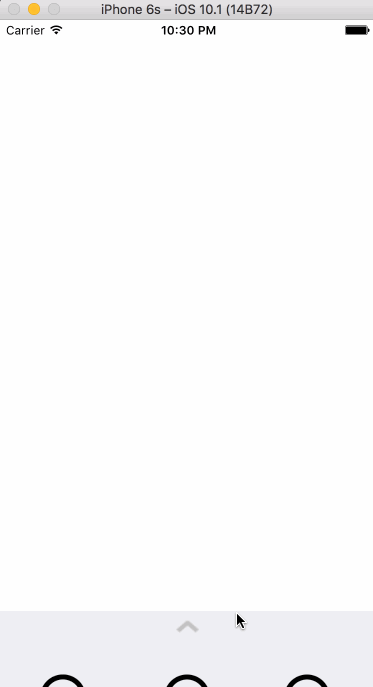

# Canvas Faces

Using gesture recognizers, and animations to build a tray of smiley faces that can be dragged onto a canvas in Swift 3.

- [x] Draggable Tray
- [x] Open + Close the Tray
- [x] Creating New Faces
- [x] Panning Faces
- [x] Scaling Faces
- [x] Rotating Faces
- [x] The Tray Arrow
- [x] Dropping a Face on the Tray
- [x] Deleting Faces

## Video Walkthrough

Here's a walkthrough of implemented user stories:

GIF created with [LiceCap](http://www.cockos.com/licecap/).

## License

Visit [www.ernestsemerda.com](http://www.ernestsemerda.com/)

    Copyright 2016 Ernest Semerda (http://www.ernestsemerda.com/)

    Licensed under the Apache License, Version 2.0 (the "License");
    you may not use this file except in compliance with the License.
    You may obtain a copy of the License at

        http://www.apache.org/licenses/LICENSE-2.0

    Unless required by applicable law or agreed to in writing, software
    distributed under the License is distributed on an "AS IS" BASIS,
    WITHOUT WARRANTIES OR CONDITIONS OF ANY KIND, either express or implied.
    See the License for the specific language governing permissions and
    limitations under the License.